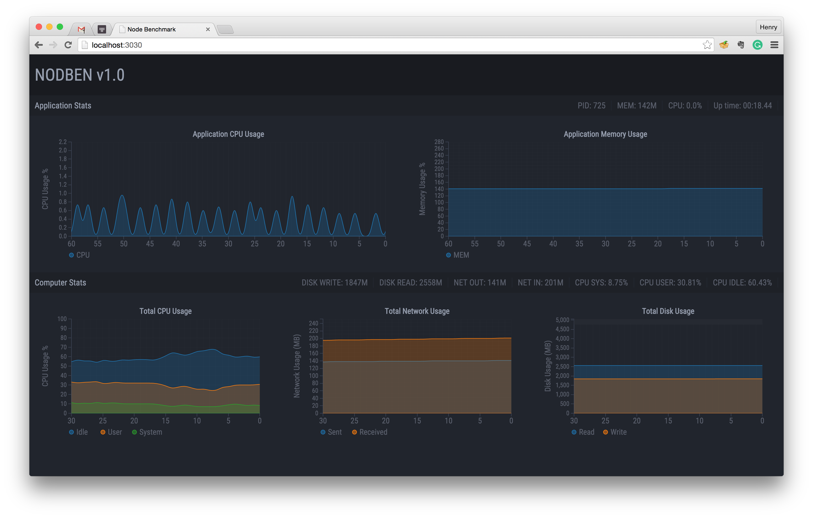

# nodben
Benchmark tool for any running process - Written in NodeJS



# Installation
Install dependencies with the following command:

```
npm install
```

Add current folder to your PATH to run `ben` command everywhere. Or just run `install.sh`

# How to use
First, you need to find the `Process ID` (pid) of the process you want to monitor:

```
ps -ax | grep <process name or command>
```

For example:

```
ps -ax | grep node app.js
```

Now, run `nodben`:

```
./ben <pid>
```

The monitoring page will be available at [http://localhost:3030](http://localhost:3030)

# To Do
Know issues/todo:
- Convert M, G, T units to Megabytes to display properly on chart
- Linux support (fix the `top` command to make it work on Linux)
- Multiple screen support (currently looks crappy on small screens)
